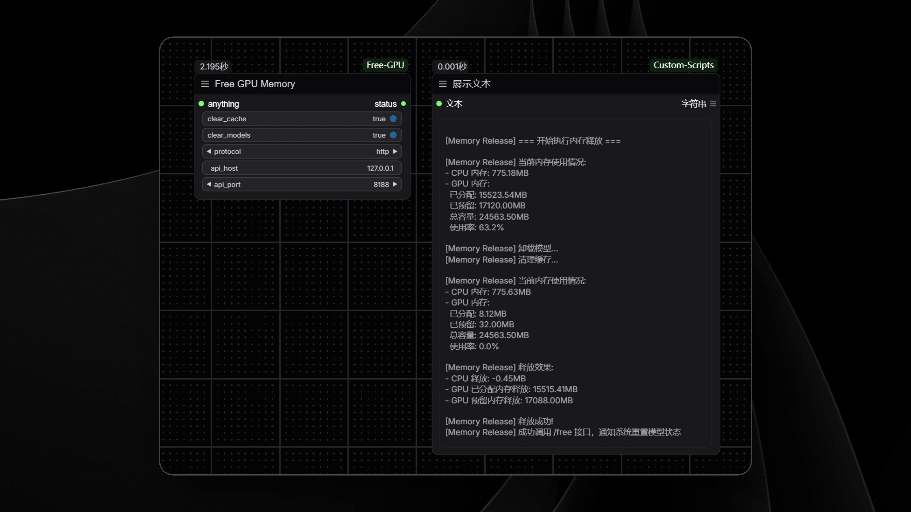

# ComfyUI-Free-GPU

[English](README_EN.md) | 简体中文

## 项目简介

`ComfyUI-Free-GPU` 提供了用于释放内存(RAM)和显存(VRAM)的节点。
当工作流中需要加载大量模型导致显存紧张，可以释放已经使用的占用，为后续工作流留出运行空间。

## 示例



## 安装方式

### 1. 手动安装

1. 找到你本地 ComfyUI 的节点目录，通常位于 `<ComfyUI 安装目录>/custom_nodes/`。
2. 打开命令行终端，进入该目录，然后通过下面的命令将本项目克隆到节点目录：
   ```
   git clone https://github.com/CY-CHENYUE/ComfyUI-Free-GPU.git
   ```
3. 重启 ComfyUI，新的节点将会自动加载。

### 2. 通过 ComfyUI 节点管理器安装

1. 启动 ComfyUI 并打开节点管理器。
2. 在节点管理器中搜索 **ComfyUI-Free-GPU**。
3. 点击安装按钮，系统将自动下载并配置该节点。

## 使用说明

- 当系统遇到内存不足或模型需要重新加载时，可通过该节点主动释放内存(RAM)和显存(VRAM)、卸载已加载模型以及清理缓存。
- 该节点在执行过程中，会依次调用内存清理、模型卸载以及缓存重置操作，并自动通知系统刷新模型加载状态。
- 在完成一个大型工作流后
- 切换不同类型的模型之前
- 系统提示内存不足时
- 想要清理系统资源，重新开始工作时


## 其他

1. 释放内存后，下次运行工作流时可能需要重新加载模型，这会花费一些时间
2. 建议在图片生成完成后再使用此节点
3. 如果释放效果不理想，可以尝试重启 ComfyUI
4. 调用 /free 接口，通知系统重置模型状态。可能会让工作流再次运行需要重新加载运行节点。

## 6. 常见问题

1. **问：为什么释放后显存占用没有明显下降？**  
   答：部分显存可能被系统预留，或者有其他程序正在使用。如果需要完全释放，建议重启 ComfyUI。
2. **问：释放后工作流变慢了是什么原因？**  
   答：这是正常现象，因为模型需要重新加载到内存中。后续运行会恢复正常速度。
3. **问：适合多久使用一次这个节点？**  
   答：建议在完成一组相关工作后使用，或者感觉系统变慢时使用，不需要频繁使用。

---

## Contact Me

- X (Twitter): [@cychenyue](https://x.com/cychenyue)
- TikTok: [@cychenyue](https://www.tiktok.com/@cychenyue)
- YouTube: [@CY-CHENYUE](https://www.youtube.com/@CY-CHENYUE)
- BiliBili: [@CY-CHENYUE](https://space.bilibili.com/402808950)
- 小红书: [@CY-CHENYUE](https://www.xiaohongshu.com/user/profile/6360e61f000000001f01bda0)