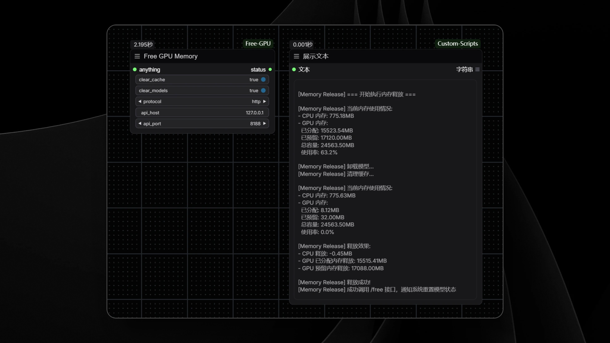

# ComfyUI-Free-GPU

English | [简体中文](README.md)

## Introduction

`ComfyUI-Free-GPU` provides a node for releasing RAM and VRAM in ComfyUI.
When your workflow requires loading multiple models and memory becomes tight, this node can help free up used memory to make space for subsequent workflow operations.

## Example



## Installation

### 1. Manual Installation

1. Locate your ComfyUI custom nodes directory, typically at `<ComfyUI Installation Path>/custom_nodes/`.
2. Open a terminal, navigate to this directory, and clone the project using:
   ```
   git clone https://github.com/CY-CHENYUE/ComfyUI-Free-GPU.git
   ```
3. Restart ComfyUI, and the new node will be automatically loaded.

### 2. Install via ComfyUI Manager

1. Launch ComfyUI and open the Manager.
2. Search for **ComfyUI-Free-GPU**.
3. Click the install button, and the system will automatically download and configure the node.

## Usage

- When the system encounters insufficient memory or models need to be reloaded, you can use this node to actively release RAM and VRAM, unload loaded models, and clear caches.
- During execution, the node will sequentially call memory cleaning, model unloading, and cache reset operations, and automatically notify the system to refresh model loading status.
- After completing a large workflow
- Before switching different types of models
- When the system indicates insufficient memory
- When you want to clean up system resources and start fresh

## Other Notes

1. After releasing memory, workflows may need to reload models when running again, which will take some time
2. It's recommended to use this node after image generation is complete
3. If the memory release effect is not ideal, try restarting ComfyUI
4. The node calls the /free interface to notify the system to reset model status, which may require workflows to reload nodes when running again

## Common Questions

1. **Q: Why isn't there a significant decrease in VRAM usage after release?**  
   A: Some VRAM might be reserved by the system or used by other programs. If you need a complete release, try restarting ComfyUI.

2. **Q: Why does the workflow become slower after releasing memory?**  
   A: This is normal as models need to be reloaded into memory. Subsequent runs will return to normal speed.

3. **Q: How often should I use this node?**  
   A: It's recommended to use it after completing a set of related work or when you feel the system is slowing down. Frequent use is not necessary.

---

## Contact Me

- X (Twitter): [@cychenyue](https://x.com/cychenyue)
- TikTok: [@cychenyue](https://www.tiktok.com/@cychenyue)
- YouTube: [@CY-CHENYUE](https://www.youtube.com/@CY-CHENYUE)
- BiliBili: [@CY-CHENYUE](https://space.bilibili.com/402808950)
- XiaoHongShu: [@CY-CHENYUE](https://www.xiaohongshu.com/user/profile/6360e61f000000001f01bda0) 